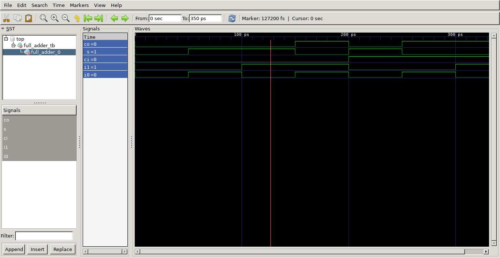
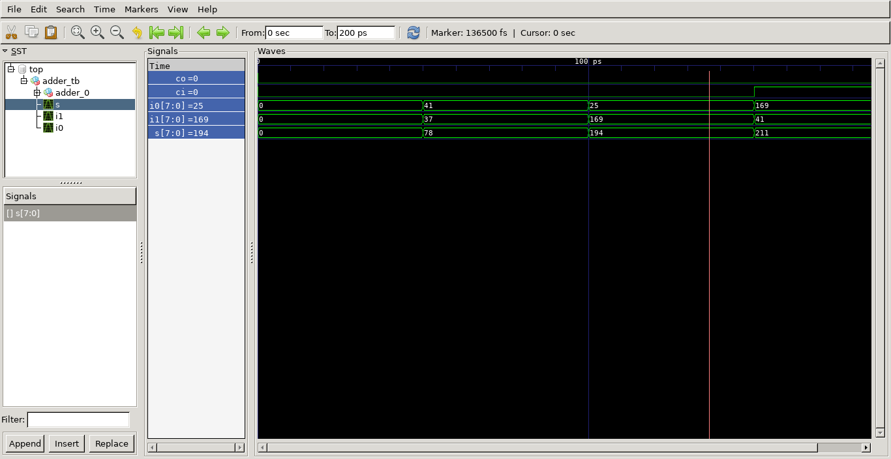

# adder_ghdl
Adder using GHDL and GTKWave

## Task definition
Test the GHDL + GTKWave flow using a Full Adder (Reference: http://ghdl.free.fr/ghdl/A-full-adder.html)

## Full Adder

Classic Full Adder to be implemented:


### Files

File       | Description
---------- | ------
full_adder | Full adder description
full_adder_tb  | Full adder testbench
adder  | 8-bit Adder.
adder_tb  | 8-bit Adder Testbench.

### Simulations

#### Requirements

- [GHDL](http://ghdl.free.fr/)

#### Procedures

In order to better organize a directory structure, I recommend to create '/src/vhdl' for source files and '/waves' for waveform files, inside a '/adder/' folder.

```bash

# Analysis of description files
$ ghdl -a ./src/vhdl/full_adder.vhdl
$ ghdl -a ./src/vhdl/adder.vhdl

# Analysis of testbench files
$ ghdl -a ./src/vhdl/full_adder_tb.vhdl
$ ghdl -a ./src/vhdl/adder_tb.vhdl

# Tests elaboration
$ ghdl -e full_adder_tb
$ ghdl -e adder_tb

# Simulation and waveforms export
$ ghdl -r full_adder_tb --wave=./waves/full_adder_tb.ghw
$ ghdl -r adder_tb --wave=./waves/adder_tb.ghw

```

### Waveforms

#### Requirements

- [GTKWave](http://gtkwave.sourceforge.net/)

#### Procedures

```bash 

# full_adder
$ gtkwave ./waves/full_adder_tb.ghw

# adder
$ gtkwave ./waves/adder_tb.ghw

```

#### Screenshots




